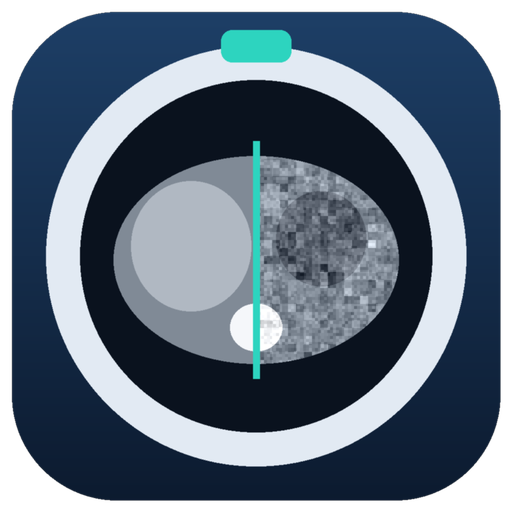
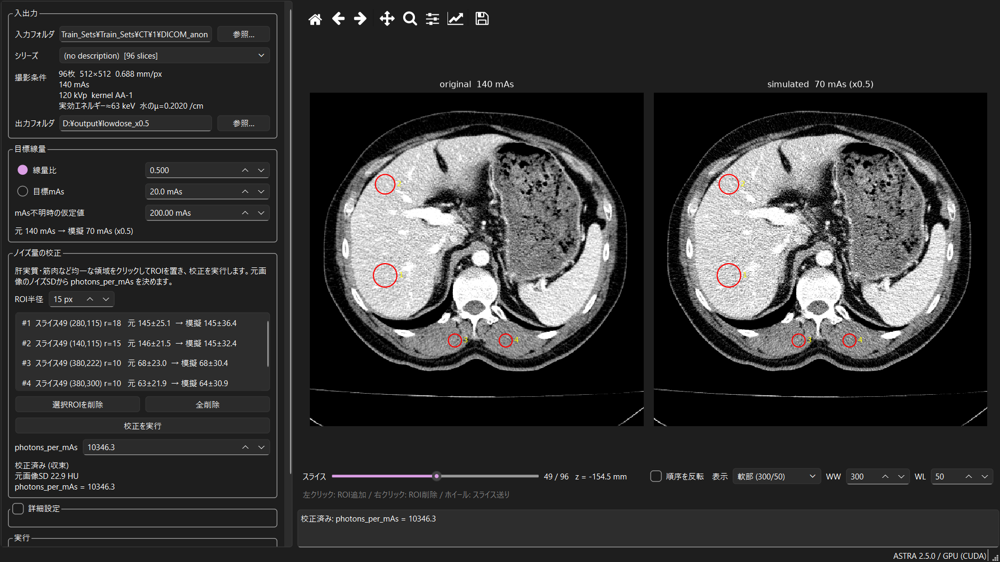

# CT Low-Dose Simulator

[](https://github.com/kawawwww/CT_lowdose_simulator/actions/workflows/tests.yml)
[](LICENSE)

通常線量で撮影された CT 画像（DICOM）から、**低線量で撮影した場合の CT 画像を模擬する**デスクトップアプリです。
投影データ上で光子数に応じたノイズを付加するため、画像上でガウシアンノイズを足すよりも現実に近いノイズ（被写体の厚みに依存する強度・筋状のパターン）が得られます。

*English: A desktop app that simulates reduced-dose CT images from routine-dose DICOM series by projection-domain noise insertion. The target dose is set relative to the mAs recorded in the DICOM header, and the noise level is calibrated against the noise measured in the original image.*



## 特長

- **DICOM の撮影条件を基準に線量を指定** — `Exposure` / `XRayTubeCurrent × ExposureTime` などから元画像の mAs を読み取り、「1/2 線量」「20 mAs」のように指定できます。スライスごとに読むため管電流変調にも対応します。
- **差分ノイズの付加** — 元画像がすでに持っているノイズを考慮し、目標線量との差の分だけノイズを付加します。
- **ノイズ量の校正** — 元画像の均一な領域（ROI）のノイズ SD から、シミュレーションの光子数を自動で決めます。
- **解像度・CT 値を保持** — ノイズ成分だけを再構成して元画像に加算するため、画像がぼけたり CT 値がずれたりしません。
- **GPU / CPU** — NVIDIA GPU があれば CUDA で高速に、なければ CPU で動作します。
- **DICOM 出力** — 元のヘッダを引き継ぎ、UID の振り直し・撮影条件タグ（mA, mAs, CTDIvol）の更新を行います。処理条件は JSON で保存されます。

## インストール

Python 3.10 以上が必要です。

```bash
pip install git+https://github.com/kawawwww/CT_lowdose_simulator.git
```

開発用にソースから入れる場合:

```bash
git clone https://github.com/kawawwww/CT_lowdose_simulator.git
cd CT_lowdose_simulator
pip install -e ".[test]"
```

[ASTRA Toolbox](https://astra-toolbox.com/)（PyPI 版は CUDA ランタイム同梱）と PySide6 も自動でインストールされます。GPU を使う場合は NVIDIA ドライバが必要です。

## 使い方（GUI）

```bash
ctlowdose-gui
```

Windows では、次のコマンドでデスクトップにアイコン付きのショートカットを作れます。

```bash
python -m ctlowdose --create-shortcut
```

1. **入力フォルダ** に CT シリーズの DICOM フォルダを指定します。撮影条件（mAs, kVp, 再構成カーネルなど）が表示されます。
2. **目標線量** を「線量比」（例: 0.5 = 1/2 線量）または「目標 mAs」で指定します。
3. **ノイズ量の校正**: 画像上の肝実質・筋肉・大動脈など**均一な領域を左クリック**して ROI を置き（右クリックで削除）、「校正を実行」を押します。
4. **プレビュー** で表示中のスライスの結果を確認します。ROI 一覧に元画像と模擬画像の平均±SD が表示されます。
5. **出力フォルダ** を指定して「一括処理して保存」を押します。

## 使い方（コマンドライン）

```bash
# 1/2 線量。スライス48の2か所のROIで校正してから処理
ctlowdose INPUT_DIR OUTPUT_DIR --ratio 0.5 --calibrate-roi 48:280:115:18 --calibrate-roi 48:380:222:10

# 目標 20 mAs、校正済みの光子数を直接指定
ctlowdose INPUT_DIR OUTPUT_DIR --target-mAs 20 --photons-per-mAs 9800
```

ROI は `スライス番号:行:列:半径`（スライス番号は 0 始まり、スライス位置順）です。`ctlowdose --help` で全オプションを表示します。

## 理論的背景

処理の全体像は次のとおりです。

```
元画像(HU) → μ → 順投影(線積分 p) → 透過率 T → 光子数にノイズを付加 → 対数変換
          → ノイズ成分のみ FBP → 元画像に加算 → 低線量画像(HU)
```

### 1. CT 値と線減弱係数

CT 値は水の線減弱係数 $`\mu_w`$ を基準に定義されます。

```math
\mathrm{HU} = 1000 \cdot \frac{\mu - \mu_w}{\mu_w}
\quad\Longleftrightarrow\quad
\mu = \mu_w \left( 1 + \frac{\mathrm{HU}}{1000} \right)
```

#### 管電圧と $`\mu_w`$

$`\mu_w`$ は X 線のエネルギーに依存するため、DICOM の管電圧（`KVP` タグ）から自動で決めます。
実際の X 線は連続スペクトルですが、本ソフトは単色 X 線で近似し、その**実効エネルギー** $`E_{\mathrm{eff}}`$ での水の減弱係数を用います。

1. 管電圧 → 実効エネルギー: 一般的な CT（付加フィルタ・ボウタイフィルタ込み）の目安値を線形補間
2. 実効エネルギー → $`\mu_w`$: NIST XCOM の水の質量減弱係数（40, 50, 60, 80, 100 keV）を両対数補間（水は $`\rho = 1`$ g/cm³ なので $`\mu/\rho`$ と同値）

| 管電圧 | 70 kVp | 80 kVp | 100 kVp | 120 kVp | 140 kVp | 150 kVp |
|---|---|---|---|---|---|---|
| $`E_{\mathrm{eff}}`$ [keV] | 46 | 50 | 56 | 63 | 70 | 74 |
| $`\mu_w`$ [cm⁻¹] | 0.242 | 0.227 | 0.214 | 0.202 | 0.194 | 0.190 |

`KVP` タグがない場合は 120 kVp とみなします。GUI の詳細設定またはコマンドラインの `--mu-water` で手入力もできます。
実効エネルギーはフィルタ条件や被写体の厚み（ビームハードニング）で変わる概算値ですが、後述の校正により $`\mu_w`$ の誤差の影響は小さく抑えられます（「8. μ_w の感度」参照）。

空気の CT 値は定義上 −1000 HU（$`\mu \approx 0`$）ですが、実際の画像には −1000 を下回る値も含まれます（空気中のノイズ、装置によっては −1024 までの格納、撮影視野外の埋め値 −2000 / −3024 など）。
これらをそのまま変換すると物理的にありえない負の $`\mu`$ になるため、**順投影の計算時だけ** −1000 HU 未満を −1000 HU（$`\mu = 0`$）に置き換えます。
ノイズ画像の加算方式では出力画像は元画像をもとにするため、元の画素値（−1000 未満の値を含む）はそのまま保たれます。

### 2. 投影と Beer–Lambert 則

入射光子数 $`I_0`$ の X 線が経路 $`L`$ を通過したときの期待検出光子数は

```math
\lambda = I_0 \exp\!\left( -\int_L \mu(\mathbf{x})\, d\ell \right) = I_0\, T,
\qquad
p = -\ln T = \int_L \mu\, d\ell
```

です。画像を画素サイズ $`\Delta x`$（`PixelSpacing`）で離散化すると、検出器ビン $`j`$ の線積分は

```math
p_j = \Delta x \sum_i a_{ji}\, \mu_i
```

となります（$`a_{ji}`$ はシステム行列。2D 平行ビーム、$`0 \le \theta < \pi`$ を等間隔に `num_angles` 方向）。
$`\Delta x`$ を掛けることで、被写体の実際の厚みに応じた透過率 $`T`$ が得られます。

### 3. 光子統計と投影値のノイズ

検出光子数 $`N`$ はポアソン分布に従い、そこに電子ノイズ $`e \sim \mathcal{N}(0, \sigma_e^2)`$ が加わります。

```math
N \sim \mathrm{Poisson}(\lambda) + e,
\qquad
\hat{p} = \ln \frac{I_0}{N}
```

デルタ法（$`d\hat{p}/dN = -1/N`$）により、対数変換後の投影値の分散は

```math
\mathrm{Var}[\hat{p}] \approx \frac{\mathrm{Var}[N]}{\lambda^2}
= \frac{\lambda + \sigma_e^2}{\lambda^2}
\approx \frac{1}{I_0\, T}
```

です（量子ノイズが支配的な場合）。**透過率 $`T`$ が小さい経路（体の厚い方向、骨を通る方向）ほど投影値のノイズが大きい**ことが、CT ノイズの空間的な不均一性や筋状アーチファクトの原因になります。

### 4. 線量と入射光子数

管電圧が同じなら、入射光子数は管電流時間積（mAs）に比例します。

```math
I_0 = k \cdot \mathrm{mAs}
```

$`k`$ はコード中の `photons_per_mAs` です。元画像の mAs（DICOM から取得）に対する目標線量の比を $`a`$ とすると

```math
I_{\mathrm{ref}} = k \cdot \mathrm{mAs}_{\mathrm{orig}},
\qquad
I_{\mathrm{low}} = a\, I_{\mathrm{ref}}
\qquad (0 < a \le 1)
```

### 5. 差分ノイズの付加

元画像はすでに撮影線量相当のノイズ（分散 $`1/(I_{\mathrm{ref}}T)`$）を含んでいます。
低線量で必要な分散は $`1/(a I_{\mathrm{ref}}T)`$ なので、**追加すべき分散は差分だけ**です。

```math
\Delta\mathrm{Var}[\hat{p}]
= \frac{1}{a\, I_{\mathrm{ref}} T} - \frac{1}{I_{\mathrm{ref}} T}
= \frac{1-a}{a\, I_{\mathrm{ref}} T}
```

これをカウント領域で実現するため、低線量の検出光子数を次のように生成します（$`z \sim \mathcal{N}(0,1)`$）。

```math
\tilde{N} = a\,\lambda_{\mathrm{ref}} + \sqrt{a(1-a)\,\lambda_{\mathrm{ref}}}\; z + e,
\qquad
\lambda_{\mathrm{ref}} = I_{\mathrm{ref}}\, T
```

平均 $`a\lambda_{\mathrm{ref}}`$、分散 $`a(1-a)\lambda_{\mathrm{ref}}`$ なので、デルタ法により

```math
\mathrm{Var}\!\left[ \ln \frac{a I_{\mathrm{ref}}}{\tilde{N}} \right]
\approx \frac{a(1-a)\,\lambda_{\mathrm{ref}}}{(a\,\lambda_{\mathrm{ref}})^2}
= \frac{1-a}{a\, I_{\mathrm{ref}} T}
```

となり、ちょうど差分の分散が得られます。元画像のノイズと独立なので、合計は $`1/(aI_{\mathrm{ref}}T)`$ すなわち低線量相当になります。
これは「高線量の投影データを二項間引きして低線量データを作る」考え方（Yu et al., 2012）を、カウントが十分大きいとしてガウス近似したものです。
$`\tilde{N}`$ が 0 以下になる極端な光子飢餓では `eps`（既定 1 カウント）で下限を設けます。

オプションの「元画像のノイズ分を差し引く」をオフにすると、元画像をノイズなしとみなし、$`N \sim \mathrm{Poisson}(a I_{\mathrm{ref}} T) + e`$ でフルのノイズを付加します。

### 6. 画像領域への伝播（ノイズ画像の加算）

FBP は線形演算 $`\mathcal{R}^{-1}`$ なので、投影値を真値とノイズに分けると再構成も分けられます。

```math
\mathcal{R}^{-1}\!\left( p + \delta p \right) = \mathcal{R}^{-1} p + \mathcal{R}^{-1} \delta p
```

そこで、**ノイズ成分 $`\delta p`$ だけを再構成して元画像に加算**します。

```math
\mathrm{HU}_{\mathrm{low}}(\mathbf{x})
= \mathrm{HU}_{\mathrm{orig}}(\mathbf{x})
+ \frac{1000}{\mu_w} \left[ \mathcal{R}^{-1}
\left( \frac{\hat{p}_{\mathrm{low}} - p}{\Delta x} \right) \right]\!(\mathbf{x})
```

画像全体を再投影・再構成し直す方法では、補間によって元画像がぼけ、元のノイズも減ってしまいます（例: SD 22.9 → 15.2 HU）。
加算方式ではこの劣化が起きず、元画像の解像度と CT 値がそのまま保たれます（オプションで再投影方式も選べます）。

FBP の各画素の分散は、その画素を通る投影値の分散の重み付き和 $`\sigma^2(\mathbf{x}) \approx \sum_j h_j(\mathbf{x})^2\, \mathrm{Var}[\hat{p}_j]`$ です。
すべての $`\mathrm{Var}[\hat{p}_j]`$ が $`(1-a)/a`$ 倍されるので、付加ノイズの分散も同じ倍率になり、元のノイズと合わせると

```math
\sigma_{\mathrm{low}}^2(\mathbf{x}) = \sigma_{\mathrm{orig}}^2(\mathbf{x}) + \frac{1-a}{a}\,\sigma_{\mathrm{orig}}^2(\mathbf{x})
= \frac{\sigma_{\mathrm{orig}}^2(\mathbf{x})}{a}
\qquad\Longrightarrow\qquad
\sigma_{\mathrm{low}} = \frac{\sigma_{\mathrm{orig}}}{\sqrt{a}}
```

が成り立ちます（1/2 線量で SD は √2 倍）。ただしこれは次節の校正で $`k`$ が正しく決まっている場合です。

### 7. ノイズ量の校正

本ソフトの幾何（2D 平行ビーム、検出器ピッチ、単色 X 線、Ram-Lak フィルタ）は実機と異なるため、$`k`$ は実機の光子数ではなく、それらの違いを吸収する**実効値**です。そこで $`k`$ を画像から決めます。

条件は「**元画像と同線量（$`a=1`$）のフルノイズを生成したとき、その画像上の SD が元画像の SD と一致する**」ことです。
ROI $`m = 1,\dots,M`$ での分散を平均して

```math
\sigma_{\mathrm{orig}}^2 = \frac{1}{M}\sum_{m} \mathrm{Var}_m\!\left[\mathrm{HU}_{\mathrm{orig}}\right],
\qquad
\sigma_{\mathrm{sim}}^2(k) = \frac{1}{M}\sum_{m} \mathrm{Var}_m\!\left[ \frac{1000}{\mu_w}\,\mathcal{R}^{-1} \delta p_{a=1}(k) \right]
```

とします。量子ノイズが支配的なら $`\sigma_{\mathrm{sim}}^2 \propto 1/k`$ なので、

```math
k_{n+1} = k_n \left( \frac{\sigma_{\mathrm{sim}}(k_n)}{\sigma_{\mathrm{orig}}} \right)^{2}
```

で更新します。電子ノイズがあると厳密には比例しないため、$`|\sigma_{\mathrm{sim}}/\sigma_{\mathrm{orig}} - 1| < 2\%`$ になるまで反復します（通常 2〜3 回で収束）。$`\sigma_{\mathrm{sim}}`$ は 4 回のノイズ実現の平均です。

**ROI を均一な領域に置く理由**: ROI 内の分散は $`\mathrm{Var}_m = \sigma_{\mathrm{noise}}^2 + \sigma_{\mathrm{anatomy}}^2`$ であり、血管や境界が入ると $`\sigma_{\mathrm{orig}}`$ が過大になります。すると $`k`$ が過小に推定され、付加ノイズが過大になります。
また、体内の位置によるノイズの違い（中心ほど大きい）はモデル自体が再現しますが、実機のボウタイフィルタなどはモデル化していないため、中心寄りと辺縁寄りの ROI を混ぜて平均すると偏りが減ります。

### 8. μ_w の感度

$`\mu_w`$ が変わると透過率 $`T`$ が変わり、投影値のノイズ $`1/(I_0T)`$ も変わります。
しかしこの変化の大部分は、校正で決まる $`k`$ が吸収します（$`\mu_w`$ が大きい → $`T`$ が小さい → 同じ画像ノイズにするには $`k`$ が大きくなる）。
$`\mu_w`$ の影響として残るのは、経路の厚みによるノイズの**空間分布**の違い（$`\exp(\mu L)`$ の効き方）だけです。

CHAOS 症例 1 で $`\mu_w`$ を変えて校正し、1/4 線量で付加したノイズの SD [HU] を比較した結果です。

| $`\mu_w`$ [cm⁻¹] | 相当する管電圧 | 校正後の $`k`$ | 肝（深部） | 肝（前方） | 筋（右） | 筋（左） | 深部/前方 |
|---|---|---|---|---|---|---|---|
| 0.180 | 150 kVp 超 | 6,663 | 46.0 | 40.8 | 36.8 | 37.9 | 1.13 |
| 0.200 | 約 125 kVp | 10,491 | 45.7 | 40.1 | 35.3 | 36.9 | 1.14 |
| 0.227 | 80 kVp | 17,178 | 49.4 | 42.8 | 36.3 | 38.8 | 1.15 |

$`k`$ は 2.6 倍変化しますが、付加ノイズの SD の差は数 %、空間分布（深部/前方の比）はほぼ同じです。
したがって実効エネルギーの見積もり誤差（±5 keV 程度）が結果に与える影響は小さいと言えます。

### 9. 検証例

CHAOS データセット症例 1（140 mAs, 120 kVp）で、肝実質・傍脊柱筋の 4 ROI を用いて校正した結果です。

| 線量比 $`a`$ | 模擬 mAs | ROI の SD（実測） | 理論値 $`\sigma_{\mathrm{orig}}/\sqrt{a}`$ |
|---|---|---|---|
| 1 | 140 | 22.9 HU | — |
| 0.5 | 70 | 32.8 HU | 32.4 HU |
| 0.25 | 35 | 44.3 HU | 45.9 HU |

平均 CT 値の変化は 0.03 HU でした。

## 出力

- 元ファイルと同じ名前の DICOM（int16, RescaleSlope=1, RescaleIntercept=0, Explicit VR Little Endian）
  - `SeriesInstanceUID` / `SOPInstanceUID` を新規発行
  - `XRayTubeCurrent`, `Exposure`, `CTDIvol` などを線量比に合わせて更新
  - `ImageType` を `DERIVED\SECONDARY` に、`SeriesDescription` を `Simulated low dose x0.5` などに変更
- `ctlowdose_params.json` — ソフトウェアのバージョン、計算方式、全パラメータ、スライスごとの mAs

## 制限事項

- **模擬できるのは「同じ管電圧のまま mAs を下げる」低線量化です。** 管電圧を下げる（例: 120 → 80 kVp）場合は、ノイズだけでなくヨード造影剤や骨の CT 値・コントラストも変わるため、本ソフトの対象外です。
- 2D 平行ビーム・単色 X 線（実効エネルギー）のモデルです。連続スペクトル、ビームハードニング、ボウタイフィルタ、ヘリカル補間、自動露出制御の挙動は模擬しません。
- ノイズの SD は校正で一致させますが、ノイズの質感（NPS）は元画像の再構成カーネルとは一致しません。
- 逐次近似再構成（AIDR, ASiR, iDose など）の画像では、元画像のノイズが光子数から期待されるより小さいため、付加するノイズが過小になります。FBP 画像での使用を推奨します。
- 詳細設定（投影数、検出器ピッチ、電子ノイズ、水の μ、計算方式）を変更したら校正をやり直してください。GPU と CPU では再構成の実装が異なるため、校正値がわずかに異なります。

## 免責

本ソフトウェアは研究・教育目的のものです。**臨床診断には使用しないでください。**
患者データを扱う際は、所属機関の規程に従って匿名化・管理してください（`.gitignore` で `*.dcm` を除外しています）。

## 参考文献

- W. van Aarle et al., "Fast and flexible X-ray tomography using the ASTRA toolbox," *Optics Express* 24(22), 2016.
- L. Yu et al., "Development and validation of a practical lower-dose-simulation tool for optimizing CT scan protocols," *Journal of Computer Assisted Tomography* 36(4), 2012.

スクリーンショット（`docs/screenshot.png`）には [CHAOS challenge](https://chaos.grand-challenge.org/) のデータセット（A. E. Kavur et al., [doi:10.5281/zenodo.3362844](https://doi.org/10.5281/zenodo.3362844)）の CT 画像を使用しています。
この画像は ROI の重ね書きと本ソフトによる模擬ノイズを加えたもので、元データと同じ [CC BY-NC-SA 4.0](https://creativecommons.org/licenses/by-nc-sa/4.0/) で提供します。

## ライセンス

ソースコードは [MIT License](LICENSE) です。ただし `docs/screenshot.png` は上記のとおり CC BY-NC-SA 4.0 です。依存ライブラリの ASTRA Toolbox は GPLv3 です。
